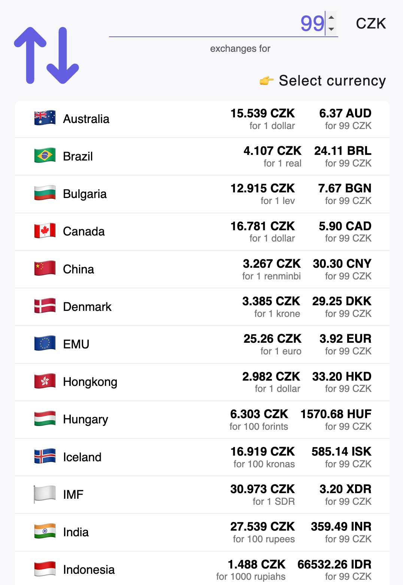

# Exchange rates sample project

## Running locally
Install dependencies using `pnpm`.
Run server `dev:vercel` and client `dev:client`

## Running tests
`pnpm test`

## 3rd party API documentation
API URL: https://www.cnb.cz/en/financial-markets/foreign-exchange-market/central-bank-exchange-rate-fixing/central-bank-exchange-rate-fixing/daily.txt
Documentation: https://www.cnb.cz/en/faq/Format-of-the-foreign-exchange-market-rates/

## Assignment Tasks

### General Rules and Requirements

-   Utilize any npm package you deem suitable.
-   In case of uncertainty about our expectations, please ask.
-   If unable to resolve an issue promptly, provide a brief explanation (e.g., missing knowledge, time constraints) and proceed.
-   Adhere to all familiar code quality principles.
-   Limit time spent on our assignment to a maximum of 2 hours. If necessary, prioritize tasks.
-   Submit your work via a git repository link (e.g., GitHub).
    -   Include the time spent on the assignment in your submission.
-   Document key solutions and decisions. Briefly explain your approach and reasoning in complex areas.

### Restrictions

-   Do not modify the API (props) of the provided components.
-   Do not use any component library (Material UI for example).
-   Do not use Tailwind CSS.

### Time Estimation

-   Start by thoroughly reading the assignment and reviewing the provided code to ensure you fully grasp the requirements.
-   Estimate the time needed to complete the assignment.
-   Email us your estimated completion time along with a realistic deadline, considering your existing commitments (e.g., work obligations, family responsibilities, vacations, or public holidays).

### Assignment Tasks

Complete all the tasks below in any order you please.

#### 1. Cache Exchange Rates
Exchange rates are fetched from the API on every page load. Modify code so that exchange rates are fetched only once per calendar day. 

#### 2. Calculate Exchange Rates for all currencies
Modify list of currencies so whenever amount of CZK is inserted, the amount of all other currencies is calculated and displayed. See image to see the desired outcome. Assume styled components are shared in another applications.

#### 3. Show history of exchange rates
When a foreign exchange rate is selected, show a line chart showing rates for last 30 days of the selected currency. See image to see the desired outcome.

